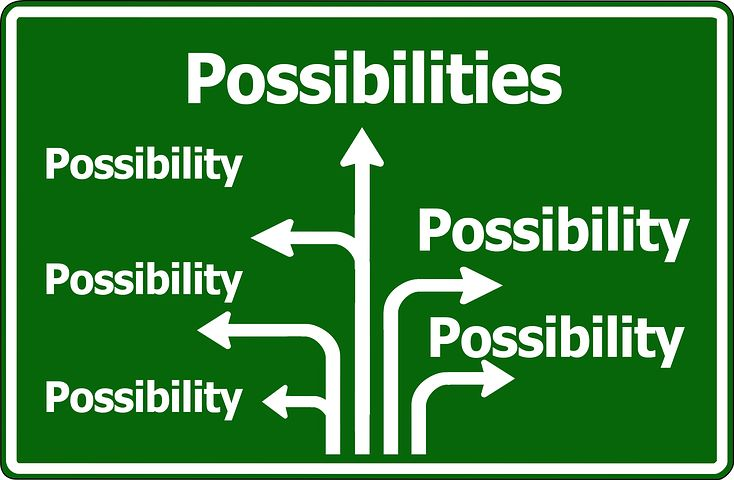

* Table of contents
{:toc}

# Learning to formalize

Under construction.

# Decision-making

We start our first adventure in theoretical modeling in the cognitive domain of *decision-making*. Decision making is the capacity for choosing one or more options from a given set of options. This can range from mundane decisions (e.g., choosing ice cream flavours or what movie to watch) to highly specialized decisions (e.g., deciding what medicine to prescribe as a doctor or what experiments to perform as a scientist). There is a long tradition of cognitive and psychological research on this topic, with roots in the behavioural economics developed in the 1950s and onwards (see the Further Reading section for some pointers).

As explained in the Introduction, our goal here will not to be retrace tradition or to review existing theoretical models. Instead, we'll be throwing you in the deep: We will present you with (more or less fictive) verbal theories in this domain, and you will formalise them. You may think you are unable to and that you first need to learn how others made models. But trust us. You can! The goal is specifically not to mimic (what you think) existing models of decision making (look like), but rather to develop your own. Remember, the purpose is not to be 'right' but rather to practice using the theoretician's tools.

For instance, when one arrives at a crossroad, one can choose to turn left or right or drive on straight. Which direction you choose may depend on where you are going, but also on the time of day (as you anticipate traffic jams) and how much in a rush you are (perhaps you want to drive the scenic route by the ocean).

Subset Choice
* Selecting toppings on a pizza
* Inviting people to a party
* Prescribing combinations of medicine
* Doing groceries
* Selecting member for a committee or team

**Exercise**
Can you think of more everyday situations where the choice options are sets as opposed to single elements?
